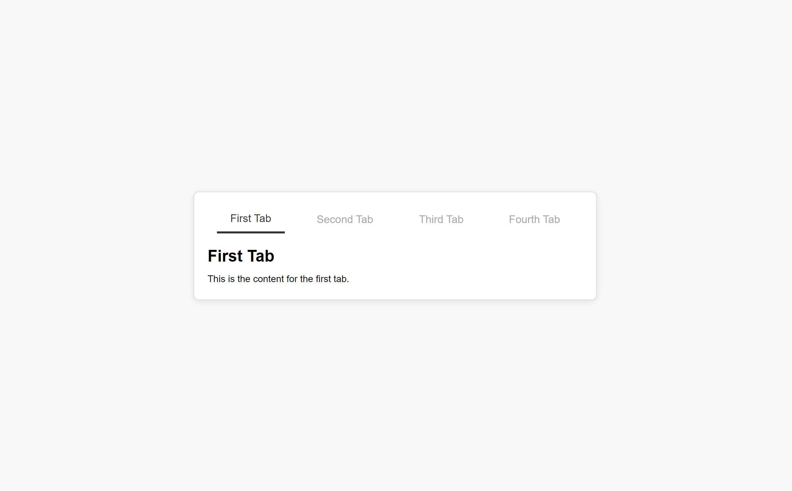

# Tabs Project

## Description

The Tabs project provides a straightforward tabbed interface for organizing content in a user-friendly manner. With this implementation, users can easily navigate between different content sections without the need for page reloads. Ideal for enhancing the user experience on websites with multiple content sections.

### Features

- **Dynamic Tab Switching:** Users can switch between tabs seamlessly with JavaScript handling the content visibility.
- **Responsive Design:** Styled to work well on various devices and screen sizes.
- **Customizable:** Easy to modify the content, styling, and tab functionality to suit different needs.

### Visuals



## Installation

To use the Tabs project:

1. **Clone the Repository**

   ```bash
   git clone https://github.com/Yashi-Singh-9/Tabs.git
   ```
   ```
   cd Tabs
   ```

2. **Open the Project**

   Open `index.html` in your web browser to view the tabs interface.

   ```bash
   open index.html
   ```

No additional installation or dependencies are required. The project is a static HTML/CSS/JavaScript setup.

## Support

For support, please open an issue on the [GitLab Issues](https://github.com/Yashi-Singh-9/Tabs/-/issues) page or contact [LinkedIn](https://www.linkedin.com/in/yashi-singh-b4143a246).

## Roadmap

- **Enhanced Customization:** Future updates may include additional customization options for tabs.
- **Accessibility Improvements:** Adding ARIA attributes to improve accessibility for users with disabilities.
- **Advanced Features:** Potential integration with frameworks like React or Vue for more complex implementations.

## Contributing

Contributions are welcome! To contribute:

1. **Fork the Repository**

   Click the "Fork" button on GitLab to create your own copy of the repository.

2. **Make Changes**

   Create a new branch for your changes and make your edits.

   ```bash
   git checkout -b feature-branch
   ```

3. **Submit a Pull Request**

   Push your changes and open a merge request on GitLab.

   ```bash
   git push origin feature-branch
   ```

Please ensure that your code adheres to the project’s style guidelines and passes any tests.

## Authors and Acknowledgments

- **Yashi Singh:** Developer / Maintainer.
- **Roadmap.sh:** [Project Creator](https://roadmap.sh/projects/simple-tabs)

## License

This project is licensed under the MIT License. See the [LICENSE](LICENSE) file for details.

## Project Status

The project is actively maintained. Contributions and feedback are welcome to help improve it further.
